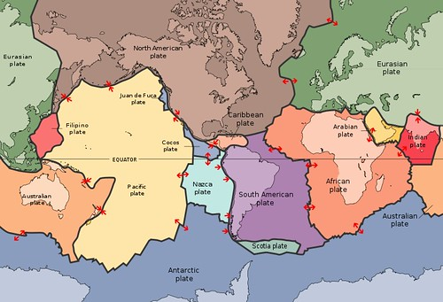
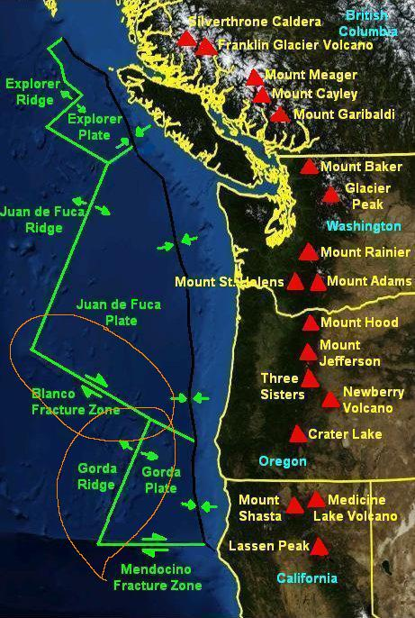
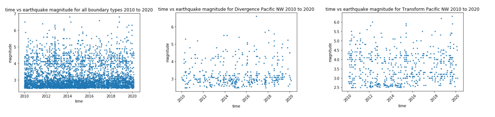

# Plate-Tectonics
Shan Siddiqui 
Dr. Abadi 
B ME 450 
3/2/20 

<b>Code Link (note maps do not load on Github, run on Jupyter Notebook or Google Colab): https://github.com/shansiddi/Plate-Tectonics/blob/master/main.ipynb</b> 

<b>Introduction</b> 
Analysis of earthquakes in the pacific north west 2010 to 2020 was conducted to further understanding of local geology. Seismic data was found on the USGS website and compared across various tectonic plate boundaries and time scales [3]. The Pacific Northwest is home to all three types of plate boundaries. The interaction between the Juan De Fuca plate and the North American plate contains divergence, transform and convergence boundaries; see figure 1 for the plates of the world.

<b>figure 1: Plate Boundaries of the World [1]</b> 

The analysis focused on comparing and contrasting divergence and trasform boundaries as well as documenting the erruption of the Axial Seamount on April 24th 2015. The following questions were addressed in the analysis. 

Problem 1) Plot earthquake magnitude versus time for the entire plate boundary, a transform boundary, and a divergence boundary. 

Problem 2) Show earthquake locations (lat and lon) on a map by circles. The radius of these circles
should be proportional to the earthquake magnitude for the entire boundary, a transform boundary, and a divergence boundary.

Problem 3 a.) Across what geographic area are you able to observe earthquake data in this map? Why do you see most of the earthquakes in that area? 

Problem 3 b.) What is the range of earthquake size (magnitude) in these data? What is the average earthquake size in this area (all boundaries)? 

Problem 3 c.) Map the earthquakes in April 2015. Where are those earthquakes mostly located? What event can you link these earthquakes to? 

Problem 3 d.) What kind of patterns in earthquake magnitude and location you observe over time along each boundary (compare the boundary types)?

A single transform and divergence boundary were selected for analysis. See figure 2 for the selections.

<b>figure 2: Juan De Fuca plate and North American plate boundary, Orange circles are the selected boundaries [2]</b>   

<b>Methods</b> 
Python scripts in Jupyter Notebook were written to address the problems. See link at top of readme for complete code, run with Jupyter Notebook or Google colab.

Method 1) Broader data from all plate boundaries of the pacific Northwest as well as the specific divergence and transform boundaries were pulled from the USGS website. Longitude, latitude, time, and magnitude of earthquake were recorded as vectors for plotting. Magnitude versus time was plotted using the matplotlib python extension.

Method 2) The geoviews package was used to construct a map of the world. On top of the map latitude and longitude of the earthquakes were superimposed to show location. Then the size of the points was scaled according to the magnitude of the earthquakes.

Method 3 a.) Information from literature about plate tectonics was compared and fit within the data collected. Relationships were found between the location of earthquakes and the plate boundaries they sat on. 

Method 3 b.) Minimum and maximum function was computed with the in house python code. The Numpy python package was used to average magnitude data.

Method 3 c.) Literature and news was searched to correlate data of April 2015 with a siesmic event. Data for the month of April 2015 was selected to show siesmic activity in just that month. 

Method 3 d.) Data for all boundary types as well as the whole plate boundary was compared with literature to find explanations of trends.

<b>Results</b> 

Results 1) Magnitude versus time for all the boundary types revealed the relative frequency of earthquakes. See figure 3 for all boundary types, divergence, and transform.

<b>figure 3: Magnitude vs Time Plots</b>  
  
Results 2)   

<b>Conclusions</b> 

References

[1] “Plate Tectonics,” Pacific Northwest Seismic Network. [Online]. Available: https://pnsn.org/outreach/about-earthquakes/plate-tectonics. [Accessed: 03-Mar-2020].

[2] S. Says: and N. *, “Be Prepared: Little exaggeration in the Pacific Northwest ‘Big One’ Earthquake Article,” Science in the News, 18-Feb-2016. [Online]. Available: http://sitn.hms.harvard.edu/flash/2015/be-prepared-little-exaggeration-in-the-pacific-northwest-big-one-earthquake-article/. [Accessed: 03-Mar-2020].

[3] Latest Earthquakes. [Online]. Available: https://earthquake.usgs.gov/earthquakes/map/. [Accessed: 03-Mar-2020].

[4] C. Brosseau, “A volcano may be erupting off the Oregon coast, scientists say,” oregonlive, 01-May-2015. [Online]. Available: https://www.oregonlive.com/pacific-northwest-news/2015/04/a_volcano_may_be_erupting_off.html?fbclid=IwAR2peQzYorW7RngYXSsgJoxPQHl9Nx0T1_56l3yjti3C5Dcr-uU1wVt9iyY. [Accessed: 03-Mar-2020].

[5] Plate Tectonics - A Scientific Revolution. [Online]. Available: http://academic.brooklyn.cuny.edu/geology/grocha/plates/platetec16.htm. [Accessed: 03-Mar-2020].
